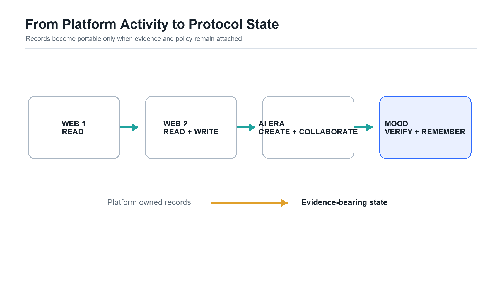
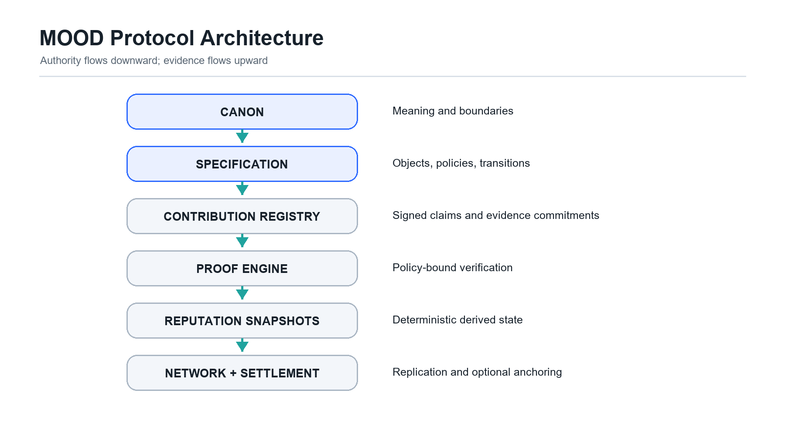
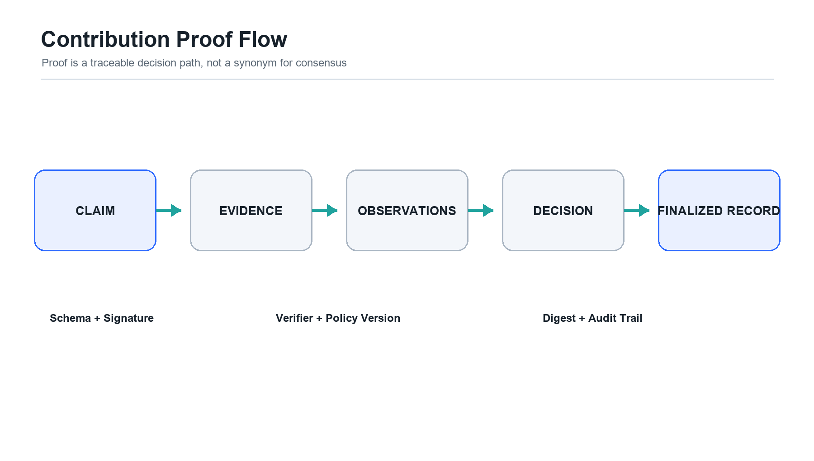
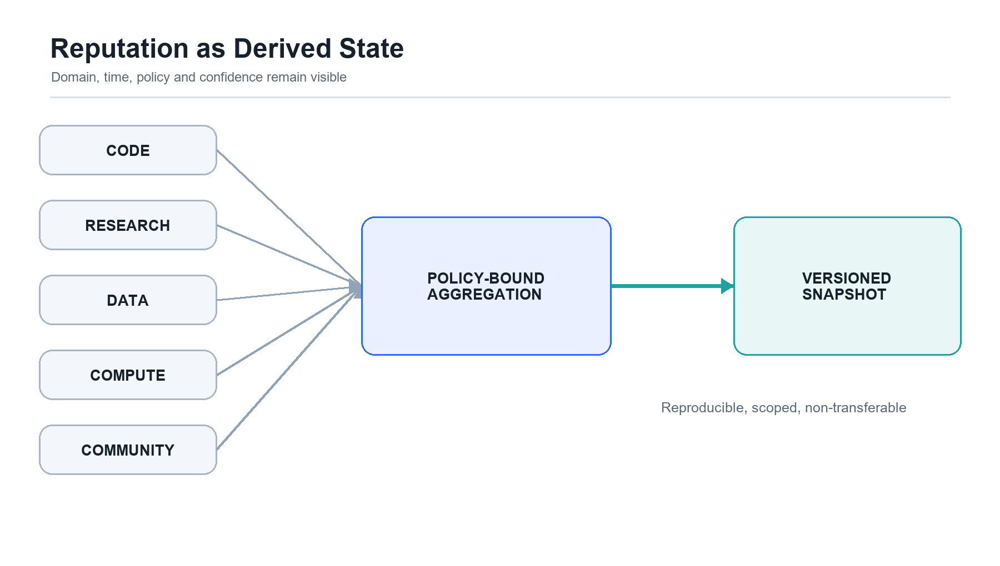
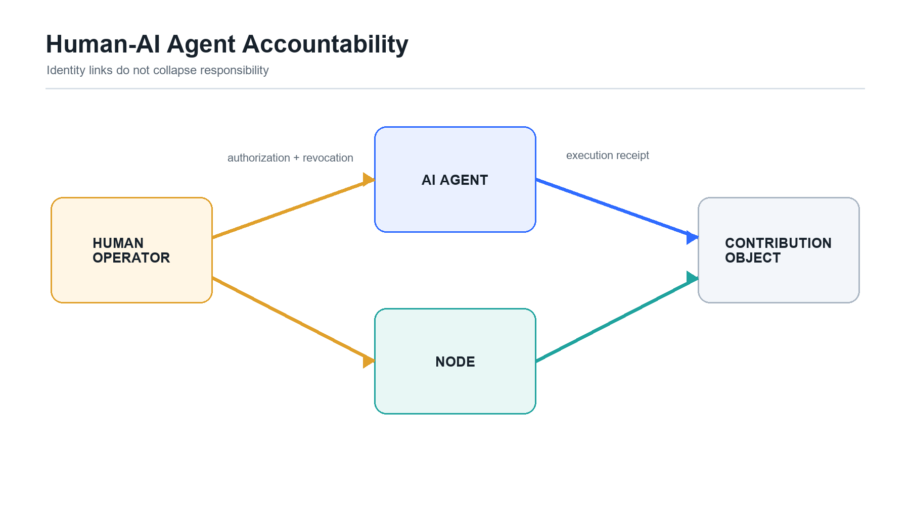
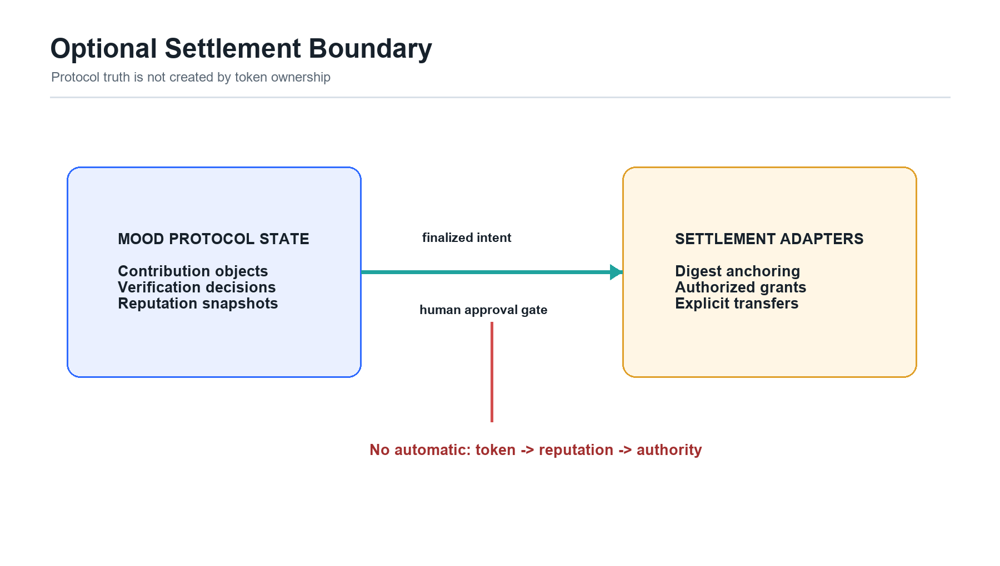
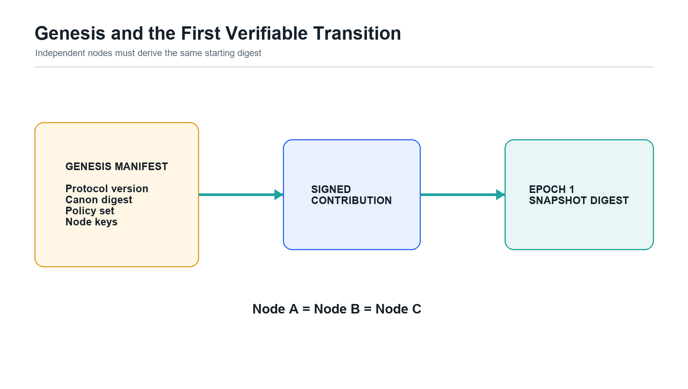

# Abstract

Digital networks record communication, transactions, and attention with increasing precision, yet they do not provide a general protocol for turning heterogeneous human and machine contributions into verifiable, durable coordination state. Source-control platforms preserve code history, labor systems exchange time for compensation, and social platforms rank visibility, but the resulting records remain platform-specific and rarely support portable proofs, longitudinal reputation, or independently reproducible decisions. The emergence of autonomous artificial-intelligence agents makes this limitation more consequential because agency, evidence, attribution, and responsibility can no longer be assumed to belong only to human account holders.

This paper introduces MOOD Protocol, a proposed contribution-state protocol for human-AI collaboration. MOOD models a contribution as a signed claim linked to evidence, policy, verification decisions, and derived reputation snapshots. It separates semantic authority, protocol rules, verification, network replication, and optional economic settlement. The protocol does not treat a token balance as proof of contribution, reputation, identity, or governance authority. Its initial reference implementation contains local contribution, reputation, node-registry, and read-only API modules; it does not yet constitute a production peer-to-peer network or a finalized consensus system. The paper defines a minimal data model, deterministic transition function, adversarial boundaries, and a phased path from a local reference implementation to independently operated nodes. It argues that the first native asset of a contribution network should be a reproducible evidence-bearing state transition rather than a speculative economic instrument.

**Keywords:** contribution proof; human-AI collaboration; verifiable state; reputation; protocol networks; decentralized coordination

# 1. Introduction

The Web evolved from publishing documents to hosting interactive applications and large-scale social coordination. This progression expanded who could produce information, but the dominant systems remained application-centered. A repository host may recognize a commit, a research platform may index a paper, and a marketplace may record a task, yet none of these events automatically becomes portable coordination state. The record is meaningful inside the platform that created it and may lose context, policy, or accessibility when moved elsewhere.

AI agents intensify this problem. A machine actor can generate code, evaluate evidence, operate infrastructure, or collaborate with people across many systems. The resulting work raises questions that ordinary account models do not answer: Who authorized the action? Which inputs were used? What evidence supports the claimed result? Can another verifier reproduce the decision? How should a correction alter historical reputation? What authority, if any, follows from accumulated contribution?

Bitcoin demonstrated that independently operated nodes can converge on shared monetary state by validating transactions under explicit rules [1], while its engineering literature shows how keys, transactions, peer discovery, and local verification compose into an operational network [2]. Ethereum generalized replicated state transition through a programmable machine [3]. MOOD addresses a different problem. It asks how heterogeneous contribution claims can become verifiable protocol objects without reducing social judgment to token ownership or pretending that every contribution can be established by a single cryptographic test.



MOOD follows a canon-first authority hierarchy: meaning precedes mechanism, and protocol rules precede implementation. This constraint is not rhetorical. A verifier cannot evaluate a contribution unless the system defines what type of claim is being made, what evidence is admissible, which policy applies, and who may issue a decision. Consequently, MOOD separates its canonical layer from replaceable software and treats unresolved concepts as explicit gaps.

The paper contributes four artifacts. First, it specifies a minimal contribution-state pipeline. Second, it distinguishes evidence verification, social evaluation, reputation derivation, replication, and economic settlement. Third, it proposes deterministic records and snapshots suitable for independent validation. Fourth, it reports the limits of the current repository implementation and defines the tests required before MOOD may claim to operate as a network.

# 2. The Contribution Problem

Existing institutions recognize work through incompatible abstractions. Employment systems primarily record contractual labor and compensation. Social platforms optimize attention signals. Source-control systems preserve changes and authorship metadata. Academic systems publish claims and citations. Compute markets meter resources. Each is useful, but none supplies a general transition from contribution to independently verifiable coordination state.

The missing relation is not simply `contribution -> value`. A contribution is initially a claim. Its evidentiary strength depends on provenance, integrity, attribution, relevance, and the policy under which it is assessed. Its effect may also change over time. A code change can be reverted; a dataset can be withdrawn; a verification decision can be appealed; an identity link can be compromised. A protocol must therefore preserve the path from claim to decision rather than publishing only a score.

MOOD defines the basic chain as:

\[
C \rightarrow E \rightarrow V \rightarrow D \rightarrow R
\]

where \(C\) is a contribution claim, \(E\) is an evidence set, \(V\) is a sequence of verification observations, \(D\) is a policy-bound decision, and \(R\) is a derived reputation state. The chain is auditable only when each edge references immutable inputs and an explicit policy version.

Three distinctions follow. Evidence is not proof merely because it is attached to a claim. Verification is not consensus merely because one service returns success. Reputation is not transferable property merely because it is represented numerically. These distinctions prevent a local implementation result from being mistaken for a network-level fact.

# 3. Protocol Architecture

MOOD is divided into six authority and execution layers. The Canon defines concepts and constraints. The specification layer defines normative objects and transitions. The contribution registry accepts and indexes claims. The proof layer evaluates evidence under versioned policies. The reputation layer derives non-transferable historical summaries. The network layer replicates signed objects and snapshots. An optional settlement interface may anchor digests or execute separately authorized economic operations.



Let the logical protocol state at epoch \(t\) be

\[
S_t = (I_t, C_t, E_t, D_t, R_t, N_t, P_t),
\]

where \(I\) denotes identities and keys, \(C\) contributions, \(E\) evidence descriptors, \(D\) verification decisions, \(R\) reputation snapshots, \(N\) node manifests and observations, and \(P\) policy versions. A valid event \(x_t\) produces

\[
S_{t+1}=\delta(S_t,x_t,P_t)
\]

only if schema validation, signature verification, authorization, replay protection, referenced-object availability, and transition preconditions succeed. Deterministic serialization is necessary because signatures and fingerprints must cover the same byte representation at every node. JSON Canonicalization Scheme provides an established approach for invariant JSON encoding [4]. Ed25519 is a candidate signing algorithm because it has a public standard and broad implementation support [5]; final cryptographic suites remain subject to a dedicated security specification.

The architecture does not require every node to store private evidence. Public protocol objects may contain evidence commitments and disclosure policies. A verifier can receive protected material through a separate channel, publish a signed decision with the relevant commitment, and avoid placing sensitive data in a public registry. This preserves auditability of the decision path without claiming that confidentiality follows automatically from hashing.

# 4. Contribution Proof System

The term *Proof of Contribution* names an evidence and decision framework, not a replacement for proof-of-work consensus. Bitcoin proof of work constrains history selection through computational expenditure [1]. MOOD contribution proof must evaluate semantically different claims: code, research, data, compute, documentation, infrastructure, and community work. No single objective predicate can establish the value of all such inputs.



A minimal contribution record contains:

```json
{
  "schemaVersion": "mood/contribution/0.1",
  "contributionId": "mood:contribution:<digest>",
  "subject": "mood:actor:<id>",
  "category": "code",
  "claim": { "title": "...", "description": "..." },
  "evidence": ["mood:evidence:<digest>"],
  "policyVersion": "mood/policy/contribution/0.1",
  "createdAt": "...",
  "nonce": "...",
  "signature": "..."
}
```

Evidence descriptors identify the evidence type, content digest, origin, collection time, disclosure class, and verifier requirements. They do not embed a truth claim. A verification decision references the contribution fingerprint, evidence fingerprints, verifier identity, policy version, result, reason codes, time window, and signature. This structure resembles the issuer-holder-verifier separation in the W3C Verifiable Credentials model [6] but does not claim automatic compatibility. W3C Data Integrity further demonstrates why proof parameters, verification methods, and protected data must remain bound together [7].

The proposed lifecycle is `draft -> submitted -> under_review -> verified | rejected -> finalized`, with `disputed`, `superseded`, and `revoked` modeled as explicit subsequent events rather than destructive mutations. Finalization means that the record and its decision are immutable; it does not mean that later evidence cannot challenge their continued relevance.

A contribution becomes eligible for reputation only when at least one admissible verification path reaches a policy-defined final state. Stronger policies may require multiple independent verifiers, challenge periods, or category-specific quorum. Those requirements are not yet canonical MOOD consensus rules and must not be inferred from the current code.

# 5. Reputation as Derived State

Reputation is a reproducible summary of accepted historical evidence, not a universal measure of human worth. It is scoped by domain, policy, time, and confidence. A single scalar leaderboard loses these dimensions and encourages gaming; MOOD therefore models a vector and publishes the inputs used to derive it.



For participant \(a\), epoch \(t\), and domain \(k\), a provisional component may be expressed as

\[
r_{a,k,t}=\sum_{c\in C_{a,t}} w_{k,\tau(c)} q(c) i_k(c) d(t,t_c),
\]

where \(w\) is a policy weight for contribution type \(\tau(c)\), \(q\) is proof confidence, \(i\) is a bounded impact assessment, and \(d\) is a declared persistence or decay function. This equation is illustrative, not a finalized economic formula. A snapshot must include the exact policy version, contribution fingerprints, verifier set, missing-data indicators, and confidence class. Identical inputs must yield identical output.

Reputation must not automatically grant governance rights. A technically strong contribution history may be relevant to review authority in one domain while irrelevant to treasury custody or constitutional change. Rights require a separate policy mapping with explicit conflict-of-interest, delegation, suspension, and appeal rules.

# 6. Human and AI Agent Participation

MOOD treats an AI agent as a potential actor with bounded agency rather than as an invisible extension of a user account. An agent identity must be linked to an operator, deployment context, declared capabilities, key material, and revocation method. Autonomous output does not remove human responsibility where a human authorized the operation or controls deployment.



Agent contributions require provenance fields for model or runtime class, tool permissions, task authorization, relevant input commitments, execution receipt, and supervising actor when applicable. Private prompts or proprietary model weights need not be published, but their absence lowers the set of claims an external verifier can reproduce. The protocol must distinguish reproducibility, independent corroboration, and attestation; these are different evidence strengths.

Agent reputation should remain separate from operator reputation. Otherwise, operators could rotate agents to escape negative history or inherit claims without demonstrating control. Link and unlink events must be signed, time-bounded, and preserved. Compromised agents must be revocable without deleting prior evidence.

# 7. Network Replication and Finality

A collection of local modules is not a network. An operational MOOD network requires independently administered nodes that can discover peers, authenticate messages, exchange content-addressed objects, validate transitions locally, and converge on declared snapshots. Content addressing, as developed in systems such as IPFS, provides a useful model for identifying immutable objects independently of storage location [8]. It does not by itself solve authorization, availability, ordering, or finality.

The proposed node protocol has four message families: `announce` for signed node manifests; `inventory` for known object identifiers and snapshot heads; `fetch` for requesting objects; and `attest` for publishing verification decisions and snapshot signatures. Every envelope includes protocol version, sender key identifier, timestamp, nonce, payload digest, and signature. Nodes reject invalid schemas, stale timestamps outside policy tolerance, reused nonces, unknown mandatory versions, and objects whose identifiers do not match their canonical digests.

MOOD v0.1 does not specify permissionless Byzantine consensus. Its first network milestone should use a transparent federated snapshot model: each node independently computes a snapshot from the same finalized event set and publishes its digest. Agreement is observed when a declared threshold of identified genesis nodes signs the same epoch digest. This is a bootstrap mechanism, not a claim of full decentralization. The governance process for changing the signer set, resolving partitions, and recovering from equivocation remains an open specification task.

# 8. Optional Blockchain Settlement

Blockchain settlement is downstream of contribution state. It may timestamp a snapshot digest, escrow an explicitly authorized grant, or execute a separately governed transfer. It must not convert token ownership into contribution evidence or silently make a chain contract the constitutional authority of MOOD.



The settlement interface accepts only finalized, policy-authorized intents. A settlement adapter must identify its chain, contract, network, signer policy, replay domain, finality rule, and rollback procedure. Human approval remains mandatory for private-key use, contract deployment, liquidity, treasury movement, and irreversible public activation. The current repository contains historical BNB Smart Chain token facts with unresolved evidence fields. This paper neither verifies those facts independently nor designates that asset as MOOD's native constitutional or economic center.

# 9. Genesis and Implementation Status

Genesis is the smallest explicit state from which independent implementations can derive the same initial result. It should contain the protocol version, canonical document digest, initial policy set, genesis node keys, timestamp rule, empty or declared initial object set, and the digest of the complete genesis manifest.



The present MOOD repository contains useful reference artifacts: schemas and lifecycle logic for contributions; local proof-verifier prototypes; reputation profiles and deterministic snapshots; a node registry with identity, capability, health, and discovery modules; and a read-only protocol API. Tests for the protocol API execute successfully in the audited workspace. Other suites currently contain missing dependencies or implementation errors. The node registry uses offline filesystem storage, and the GitHub verifier includes mock data. Therefore, the implementation is best described as a local protocol prototype.

Progression to a network claim requires at minimum: one normative wire specification; cryptographic test vectors; a durable storage adapter; three independently launched node processes; cross-node object exchange; deterministic snapshot convergence; restart recovery; malformed-message and replay tests; key rotation and revocation tests; and public execution evidence tied to source commits. Production, mainnet, decentralized, and trustless labels are inappropriate until these conditions are demonstrated.

# 10. Security, Governance and Limitations

The principal threats are false attribution, duplicate claims, verifier collusion, compromised keys, Sybil identities, replay, evidence disappearance, policy manipulation, privacy leakage, reputation gaming, and governance capture. Content hashes detect change but do not establish authorship or truth. Signatures establish control of a key, not the legitimacy of the actor. Multiple attestations improve evidentiary diversity only when verifiers are meaningfully independent.

Protocol governance must therefore distinguish four authorities: canonical amendment, policy publication, operational validation, and economic execution. No single reputation score or token balance should automatically control all four. Every normative change requires a versioned proposal, review record, effective epoch, compatibility statement, and migration plan.

This paper has five limitations. First, contribution semantics remain incomplete in the Canon. Second, the scoring equation is illustrative. Third, no permissionless consensus or Sybil-resistance mechanism is specified. Fourth, privacy-preserving verification has not been implemented. Fifth, the current evidence is repository-local and does not demonstrate a live multi-operator network. These limits define the Phase One research agenda rather than defects to hide behind promotional language.

# 11. Conclusion

MOOD proposes a coordination protocol in which contribution claims become durable only through explicit evidence, policy-bound verification, deterministic state transition, and independently reproducible snapshots. The design separates reputation from identity, rights from reputation, and settlement from constitutional authority. This separation allows software, storage, and blockchain adapters to change without silently redefining the world the protocol serves.

The next credible milestone is not a dashboard or token launch. It is a three-node reference network that can exchange the same signed contribution objects, verify them under the same policy, and publish the same snapshot digest. When that result can be reproduced by independent operators, MOOD will possess the minimum evidence required to call itself a network.

# Declarations

**Data availability.** No new empirical dataset was created. Repository materials used for the implementation-status assessment are available in the MOOD repository. External standards and papers are listed below.

**Ethics.** This protocol paper involves no human participants or personal data collection. Future contribution systems must define privacy, consent, appeal, and automated-decision safeguards before processing real participant data.

**Author contributions (CRediT).** MOOD Project Contributors: Conceptualization, Methodology, Software, Validation, Visualization, Writing - original draft, and Writing - review and editing. Individual attribution remains to be finalized by the project maintainer.

**Conflict of interest.** No conflict of interest has been declared. MOOD-associated economic instruments, if any, are outside the evidentiary scope of this paper.

**Funding.** No external funding source was verified for the preparation of this paper.

**AI disclosure.** Generative AI was used to assist repository analysis, literature organization, drafting, translation, figure construction, and formatting. Conceptual authority remains with `MOOD_CANON.md`; all public claims require human review before release.

# References

[1] S. Nakamoto, “Bitcoin: A Peer-to-Peer Electronic Cash System,” 2008. https://bitcoin.org/bitcoin.pdf

[2] A. M. Antonopoulos and D. A. Harding, *Mastering Bitcoin: Programming the Open Blockchain*, 3rd ed. O'Reilly Media, 2023. https://github.com/bitcoinbook/bitcoinbook

[3] G. Wood and Ethereum Yellow Paper Contributors, “Ethereum: A Secure Decentralised Generalised Transaction Ledger,” 2025. https://ethereum.github.io/yellowpaper/paper.pdf

[4] A. Rundgren, B. Jordan, and S. Erdtman, “JSON Canonicalization Scheme,” RFC 8785, 2020. doi:10.17487/RFC8785.

[5] S. Josefsson and I. Liusvaara, “Edwards-Curve Digital Signature Algorithm (EdDSA),” RFC 8032, 2017. doi:10.17487/RFC8032.

[6] World Wide Web Consortium, “Verifiable Credentials Data Model v2.0,” W3C Recommendation, 2025. https://www.w3.org/TR/vc-data-model/

[7] World Wide Web Consortium, “Verifiable Credential Data Integrity 1.0,” W3C Recommendation, 2025. https://www.w3.org/TR/vc-data-integrity/

[8] J. Benet, “IPFS - Content Addressed, Versioned, P2P File System,” arXiv:1407.3561, 2014. doi:10.48550/arXiv.1407.3561.

